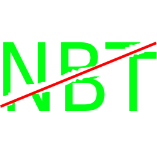
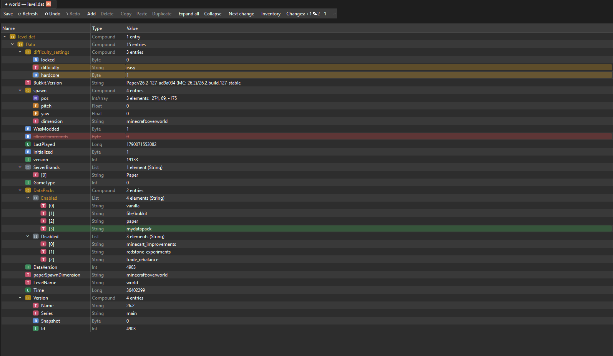
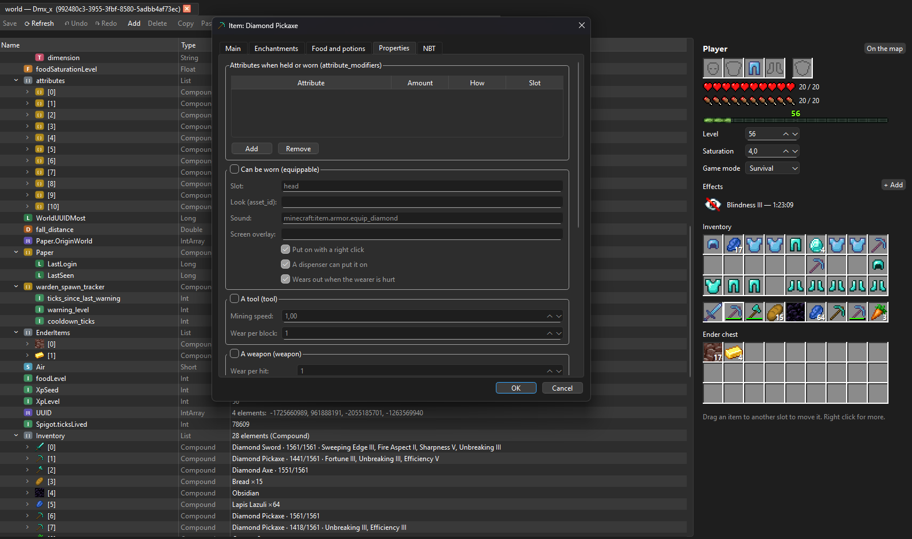
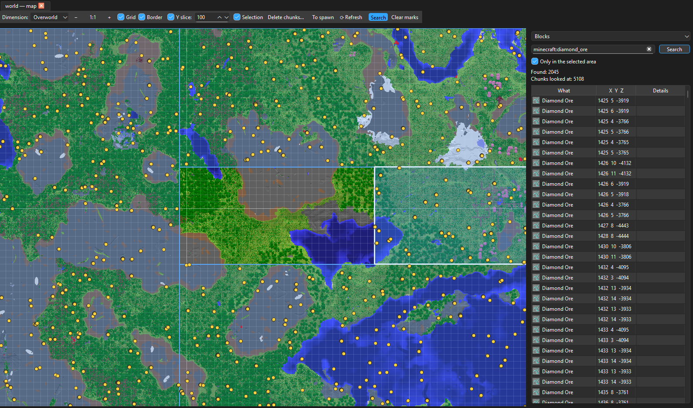
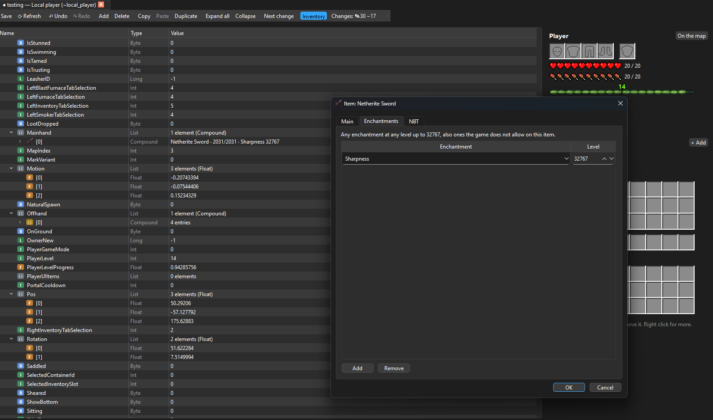

<p align="center">
  
</p>

<h1 align="center">JustNBT</h1>

<p align="center">
  A free NBT editor for Minecraft Java and Bedrock, with features that set it apart from other free NBT editors.
</p>

<p align="center">
  <a href="../../releases/latest">Download</a> ·
  <a href="#building-from-source">Build from source</a> ·
  <a href="LICENSE">License</a>
</p>

## Features

### Java and Bedrock `level.dat` editing

Edit any tag of a world's `level.dat`. Changes are highlighted until you save: green for added
tags, yellow for changed ones, red for deleted ones. Everything can be undone with Ctrl+Z.



### Java player data editing

A player's inventory, armor and ender chest are shown as slots, just like in the game. Drag
items between slots, click the hearts and the food bar to set them, and edit an item's
enchantments, durability, name and components such as food, consumable or attributes.



### Java and Bedrock map

A 2D map of the world with every dimension. Search it for blocks, items in chests, entities
and points of interest, select chunks and delete them.



### Bedrock LevelDB editing

Players, chunks and all the other records of a Bedrock world's database, with the same
inventory view and item editor as in Java.



### Backups

Before saving, JustNBT makes a backup of the file, so if anything goes wrong you can put the
old file back. **Help → Backups and cache…** opens the backup folder and sets how long
backups are kept.

## Downloading

Ready-to-use versions for Windows and Linux are on the [Releases](../../releases) page.

- **Windows:** download `JustNBT-<version>-windows-x64.zip`, unzip it anywhere and run
  `JustNBT.exe`. Nothing needs to be installed. Windows SmartScreen may warn about an
  unknown publisher: click **More info → Run anyway**.
- **Linux:** download `JustNBT-<version>-x86_64.AppImage`, make it executable and run it:

  ```bash
  chmod +x JustNBT-*-x86_64.AppImage
  ./JustNBT-*-x86_64.AppImage
  ```

Item names and pictures are taken from a Minecraft Java installation on your computer (the
official launcher, see **File → Minecraft for item names and pictures…**).
Without one, JustNBT still works and shows items by their ids.

## Building from source

You need:

- a C++20 compiler (GCC 12 or newer, or MinGW 13.1 on Windows)
- CMake 3.21 or newer and Ninja
- Qt 6.4 or newer (Core, Gui, Widgets, Network, and Qt Linguist tools for the translations)
- Git, and an internet connection for the first build: libdeflate and LZ4 are downloaded
  by CMake

### Windows

1. Install Qt with the [Qt Online Installer](https://www.qt.io/download-qt-installer-oss).
   In the component list choose:
   - **Qt → Qt 6.8.3 → MinGW 13.1.0 64-bit**
   - **Build Tools → MinGW 13.1.0 64-bit**, **CMake** and **Ninja**
2. Install [Git](https://git-scm.com/download/win).
3. In PowerShell (the paths assume Qt is installed in `C:\Qt`):

   ```powershell
   git clone https://github.com/realciviluser/JustNBT.git
   cd JustNBT
   $env:PATH = "C:\Qt\Tools\mingw1310_64\bin;C:\Qt\Tools\CMake_64\bin;C:\Qt\Tools\Ninja;$env:PATH"
   cmake -S . -B build -G Ninja -DCMAKE_BUILD_TYPE=Release -DCMAKE_PREFIX_PATH=C:/Qt/6.8.3/mingw_64
   cmake --build build --parallel
   .\build\JustNBT.exe
   ```

The build copies the Qt libraries next to `JustNBT.exe`, so the `build` folder can be run as it
is.

### Linux

On Ubuntu 24.04, Debian 13 or newer:

```bash
sudo apt install build-essential cmake ninja-build git \
    qt6-base-dev qt6-tools-dev qt6-tools-dev-tools qt6-l10n-tools libgl-dev
git clone https://github.com/realciviluser/JustNBT.git
cd JustNBT
cmake -S . -B build -G Ninja -DCMAKE_BUILD_TYPE=Release
cmake --build build --parallel
./build/JustNBT
```

On other distributions, install the same things with your package manager: a C++20 compiler,
CMake, Ninja, Git and the Qt 6 development packages (base and tools).

To add JustNBT to the application menu, install it (to `/usr/local` by default):

```bash
sudo cmake --install build
```

## Reporting bugs

Found a bug or something that looks wrong? Please [open an issue](../../issues/new/choose),
even if it seems small.

Files attached to an issue are public: anyone can download them. GitHub does not accept
`.dat` or `.mca` files as they are, so put them in a `.zip` first.

## License

JustNBT is free software under the [GNU General Public License v3.0](LICENSE). You may use,
study, change and share it; a changed version you share has to stay under the same license,
with its source code.

The name "JustNBT" and the JustNBT icon are not covered by the license. If you publish a
changed version, please give it a different name and icon.

JustNBT uses Qt, LevelDB, libdeflate and LZ4; see [THIRD_PARTY_NOTICES.md](THIRD_PARTY_NOTICES.md)
for their licenses.

JustNBT is not an official Minecraft product and is not approved by or associated with Mojang
or Microsoft.
